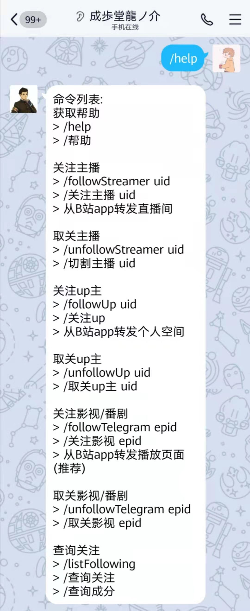
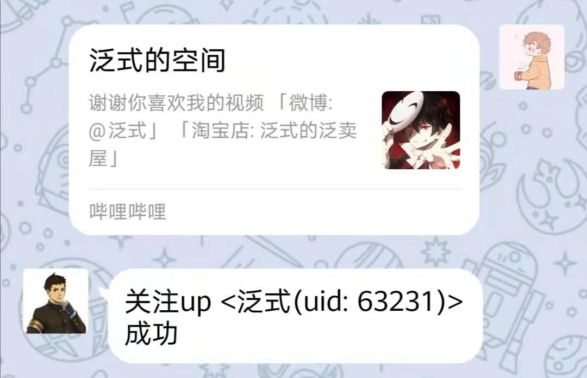
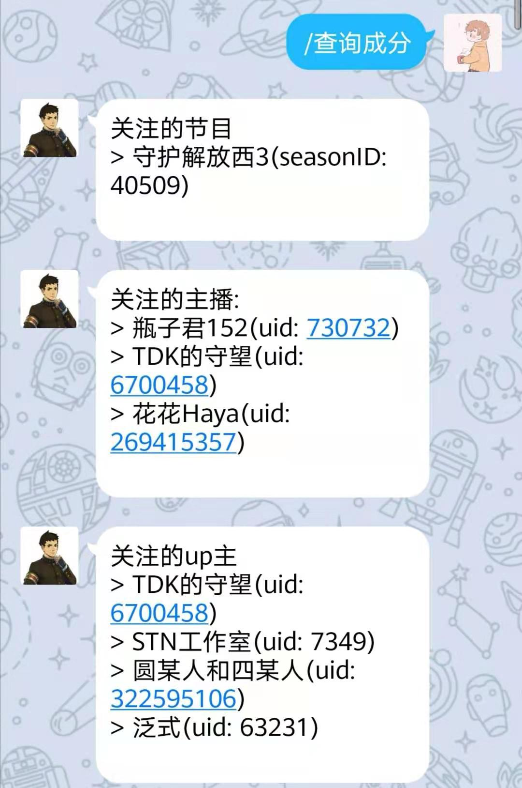

# nonebot_plugin_bilibilibot

  

# nonebot-plugin-bilibilibot

👾 _NoneBot bilibili通知插件_ 👾
    

## 简介
基于Nonebot的bilibili通知插件，可将up主，主播以及番剧的更新/直播动态推送到QQ

## 特色功能
- 可通过在B站客户端分享用户主页进行关注up主

- 可通过在B站客户端分享直播间进行关注主播

- 可通过分享番剧播放页面进行关注番剧

## 示例
### 获取帮助

### 视频更新推送

### 直播开播推送

### 通过B站客户端分享进行关注

### 查询关注列表

## 特别鸣谢
- 感谢0w0w0帮助测试
